# 🎥 AI Short Video Creator - ASP.NET & React Web Application

## 1. Giới thiệu

**AI Short Video Creator** là nền tảng web giúp người dùng dễ dàng tạo video ngắn dưới 1 phút bằng công nghệ AI. Ứng dụng hỗ trợ tạo nội dung từ gợi ý chủ đề → sinh kịch bản → tạo giọng đọc → ghép video → xuất bản lên các nền tảng youtube, facebook.  
Hệ thống cung cấp các tính năng nâng cao như tìm kiếm chủ đề theo xu hướng, tùy chọn phong cách video, xuất bản video lên mạng xã hội và phân quyền người dùng (User / VIP).

---

## 2. Cấu trúc dự án

```
aigen-video/
├── AIGenVideo.Server/         # ASP.NET Web API (.NET 8)
│   ├── Controllers/           # API Controllers
│   ├── Services/              # Business logic: YouTube, Facebook, TikTok, FFmpeg
│   ├── Models/                # DTOs, Entities
│   ├── Data/                  # DbContext & Migrations
│   └── Program.cs, Startup.cs # Entry point & config
│
├── AIGenVideo.Client/         # React frontend (Vite + Tailwind)
│   ├── pages/                 # Giao diện người dùng
│   ├── components/            # UI components
│   ├── hooks/                 # React hooks
│   └── vite.config.js         # Vite config
├── infras/Service             # Chứa các service bên thứ 3 (Momo,...)
├── docker-compose.yml         # Docker Compose cấu hình backend + frontend + db + redis
├── README.md                  # Hướng dẫn dự án
├── .env                       # Biến môi trường cấu hình
```

---

## 3. Chức năng chính

### 👤 Người dùng

- Đăng ký, đăng nhập (Google OpenId Connect, email + password)
- Mua Vip cho tài khoản ( thanh toán bằng Vnpay, Momo )
- Tạo video tự động: nhập từ khóa → sinh kịch bản → sinh video
- Tìm kiếm chủ đề xu hướng trên các nền tảng
- Tuỳ chọn giọng đọc AI hoặc ghi âm giọng người thật
- Chỉnh sửa video cơ bản (hiệu ứng chữ, sticker, nhạc nền)
- Xuất video định dạng `.mp4`, xem lại video đã tạo
- Quản lý video đã tạo
- Xem thống kê hiệu suất video trên các nền tảng
- Xuất bản video lên các nền tảng (Youtube, facebook)
- Tùy chọn phong cách video (Anime, Cartoon, Romantic…)

### 🛠️ Quản trị viên

- Quản lý người dùng, phân quyền User / VIP
- Quản lý dashboard hệ thống
- Quản lý các giao dịch

---

## 4. Tính năng nổi bật

- 🤖 **AI Chatbot nội dung:** Gợi ý chủ đề, sinh kịch bản tự động
- 🗣️ **TTS AI Voice:** Chuyển văn bản sang giọng đọc tiếng Việt tự nhiên
- 🎬 **Ghép video tự động:** Kết hợp hình ảnh, giọng đọc, phụ đề
- 🌐 **Đăng video mạng xã hội:** Tích hợp YouTube, TikTok, Facebook Reels API
- 🔐 **Phân quyền + Thanh toán:** Tài khoản VIP có thể sử dụng đầy đủ tính năng
- 💵 **Thanh toán đa cổng:** Hỗ trợ Momo, VNPAY, Internet Banking
- 🔐 **Bảo mật nâng cao:** Mã hoá token, xác thực OAuth2, gửi OTP SMS
- 📊 **Thống kê video:** Lượt xem, lượt tải, thời lượng trung bình...

---

## 5. Hướng dẫn chạy dự án

### ✅ Cách 1: Dùng Docker Compose (Khuyên dùng)

#### Bước 1: Clone dự án

```bash
git clone https://github.com/mquangcao/AIGenVideo.git
```

#### Bước 2: Di chuyển vào thư mục dự án

```bash
cd AIGenVideo
```

#### Bước 3: Điền các tham số, biến môi trường yêu cầu trong Folder Docker

#### Bước 4: Chạy ứng dụng với Docker

```bash
docker compose build
docker compose up -d
```

#### Truy cập ứng dụng

- **Frontend (React):** http://localhost:3000
- **Backend API (ASP.NET):** http://localhost:3008

#### Database (SQL Server):

- Host: `localhost`
- Port: `1433`
- User: `sa`
- Password: `Quangcao123!`

#### Dừng toàn bộ dịch vụ

```bash
docker compose down
```

---

### ⚙️ Cách 2: Tự chạy backend & frontend

#### Backend (ASP.NET)

- Cài đặt .NET 8 SDK
- Cấu hình các tham số yêu cầu trong `appsettings.json`
- Chạy lệnh sau trong thư mục `AIGenVideo.Server/`:

```bash
cd AIGenVideo.Server
dotnet ef database update
dotnet run
```

#### Frontend (React)

- Cài đặt Node.js >= 18
- Cài đặt dependencies và chạy dev server:

```bash
cd aigenvideo.client
npm install
npm run dev
```

---

### User & VIP User

- Màn hình đăng nhập
  [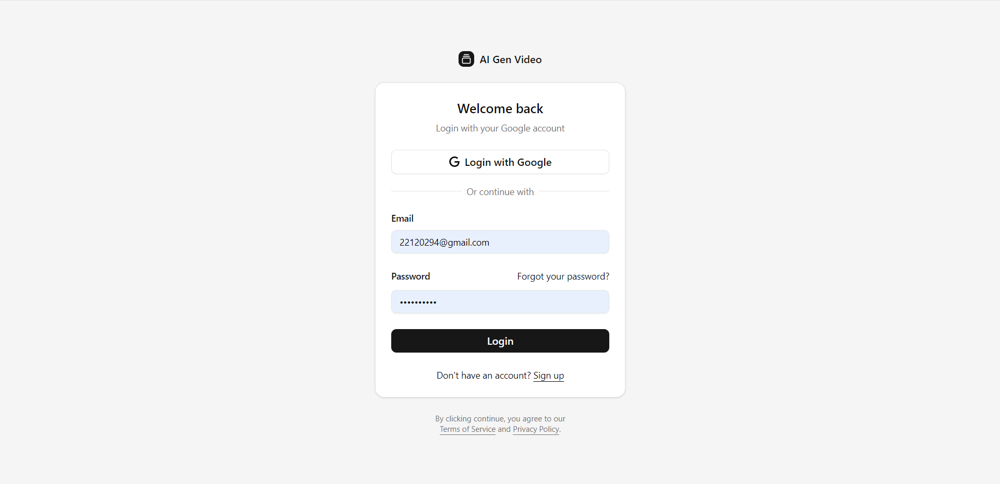]()
- Trang chủ
  [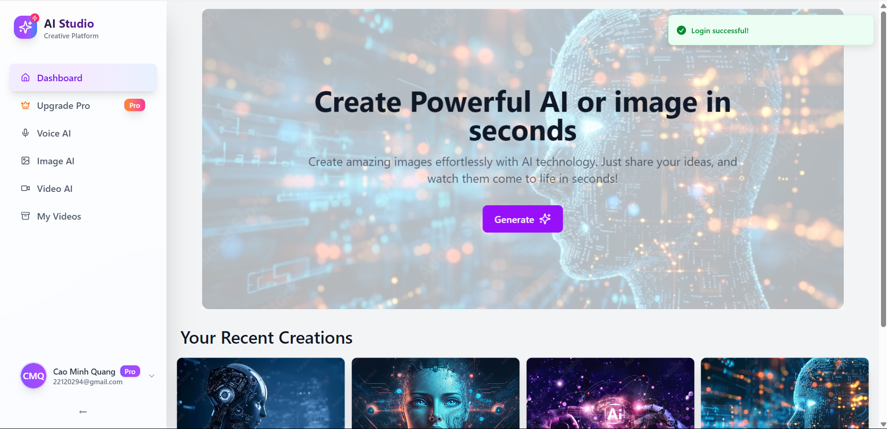]()
- Màn hình tạo giọng đọc AI
  [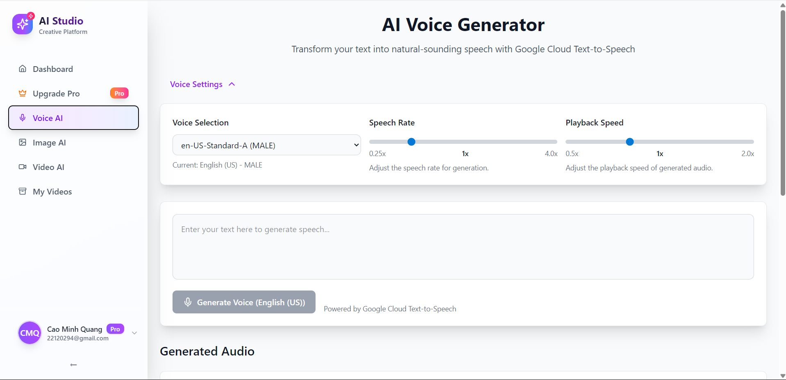]()
- Màn hình tạo ảnh AI
  [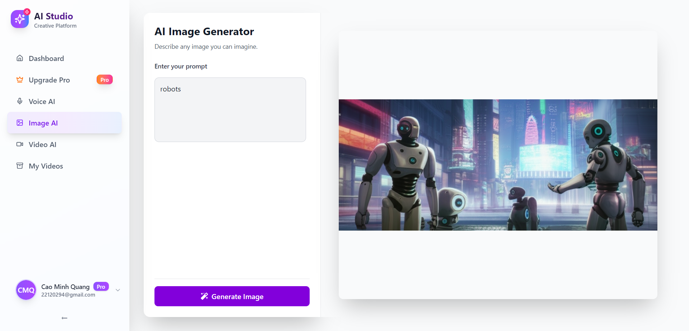]()
- Màn hình gợi ý nội dung xu hướng
  []()
- Màn hình tùy biến kịch bản video
  [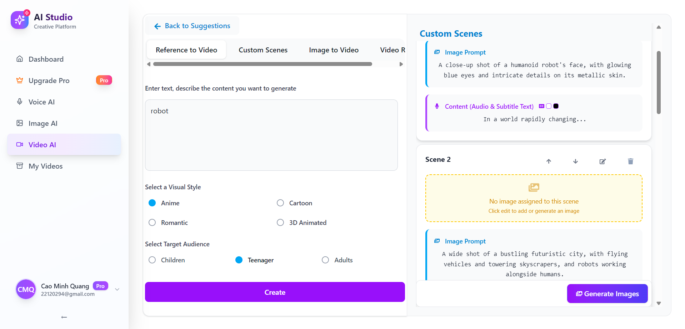]()
- Màn hình sinh ảnh video
  [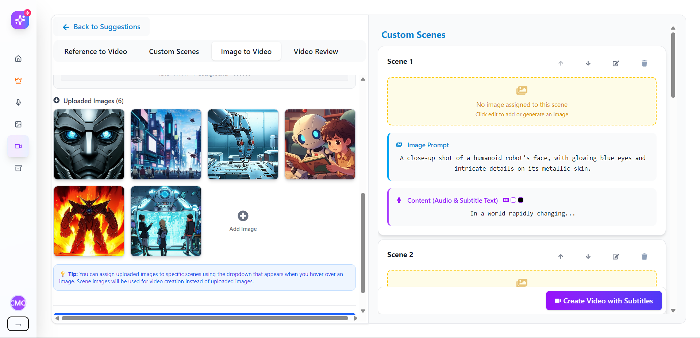]()
- Màn hình video của tôi
  []()
- Màn hình chia sẻ video
  [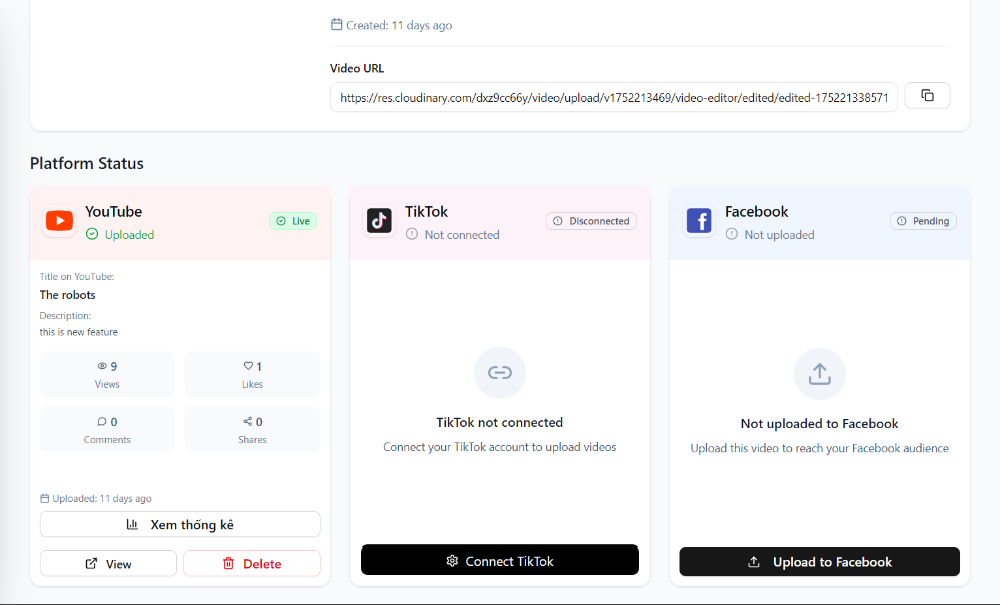]()
- Màn hình thống kê hiệu suất video
  [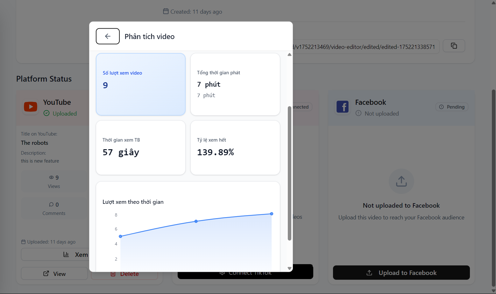]()
- Màn hình thanh toán VIP
  [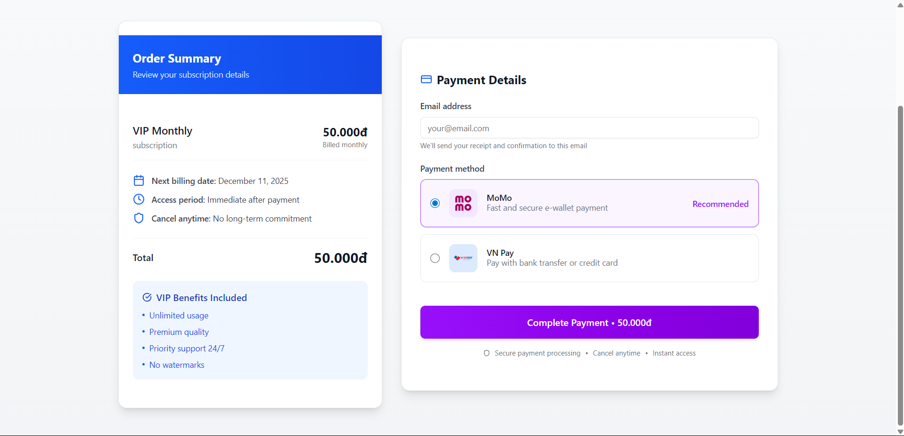]()

### Admin

- Màn hình trang chủ
  [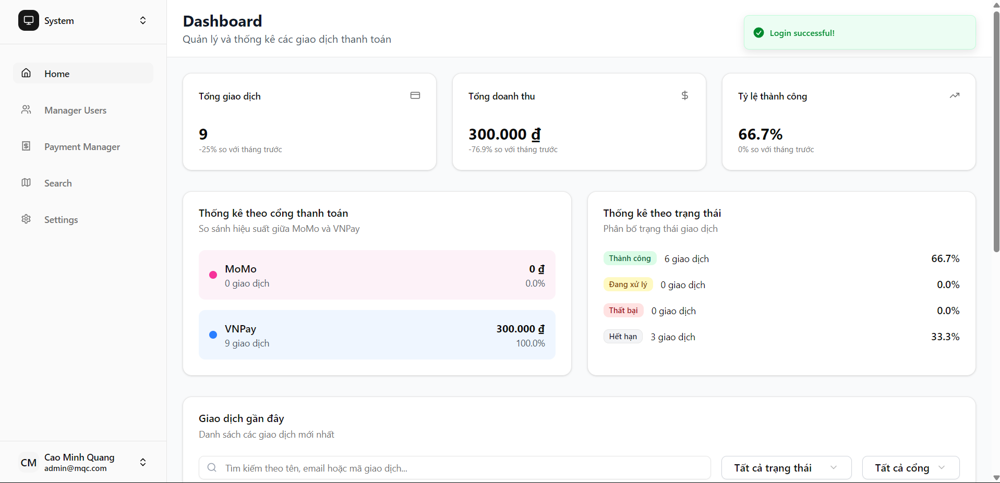]()
- Màn hình quản lý user
  [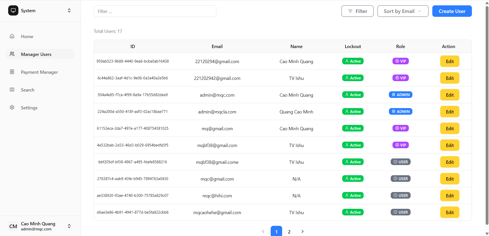]()

## 6. Thông tin kỹ thuật

| Công nghệ         | Mô tả                       |
| ----------------- | --------------------------- |
| ASP.NET 8         | Web API backend             |
| React + Vite      | SPA frontend                |
| FFmpeg            | Xử lý video                 |
| OpenAI / Groq API | Sinh kịch bản AI            |
| Open Id Connect   | Đăng nhập người dùng        |
| OAuth2            | Lấy token của bên thứ 3     |
| SQL Server        | Cơ sở dữ liệu chính         |
| Redis             | Caching, token storage      |
| Docker Compose    | Triển khai đồng bộ hệ thống |

---

## 7. Đóng góp

Chúng tôi luôn chào đón đóng góp từ cộng đồng.

- Fork repository
- Tạo nhánh mới từ `main`
- Commit và tạo pull request
